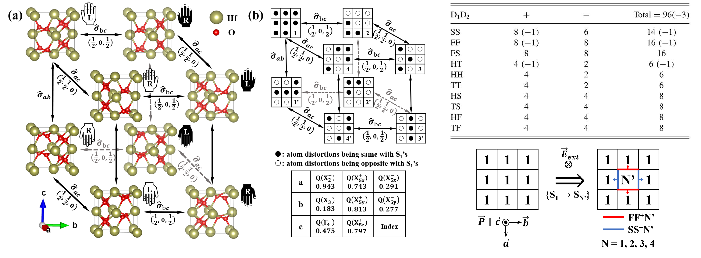
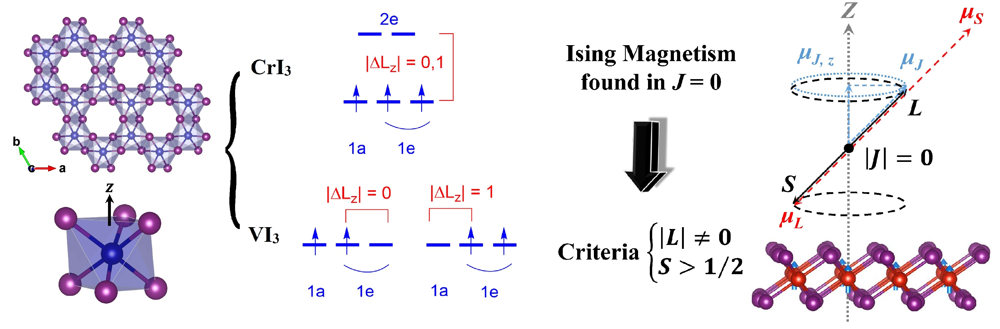
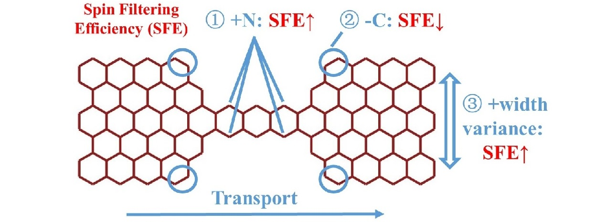

## Guo-Dong Zhao (赵国栋) 

[My Researchgate](https://www.researchgate.net/profile/Guo-Dong-Zhao-2)  
Email: zhaoguodong@fudan.edu.cn  

### Research Topics
1. **Ferroelectric Switching Dyanmics**: Characteristics of FE-HfO2 from multiscale simulations
2. **Symmetry and Group Theory**: Classify all the ferroelectric switching paths and orthogonal domain walls in complex ferroelectrics, e.g., in [FE-HfO2](https://doi.org/10.1103/PhysRevB.106.064104)
3. **Low-Dimensional Magnetism**: [Monte Carlo](https://github.com/heracleszgd/MaCMoC) with effective spin Hamiltonian, [Ising-2DFM VI3](https://doi.org/10.1103/PhysRevB.103.014438), Janus-TMD, vdW-heterestructures, Dzyaloshinsky-Moriya interaction (DMI), Skyrmions
4. **Quantum Transportation**: [spintronics](http://doi.org/10.1039/C8RA07343K), tunneling junctions, CMOS devices

### Skills
- **First-Principles**: [VASP](https://www.vasp.at/), [ABINIT](http://www.abinit.org/), [QE](https://www.quantum-espresso.org/), [RESCU](https://nanoacademic.com/solutions/rescu/), [Exciting](http://exciting.wikidot.com/); [CP2K](https://www.cp2k.org/), [Nanodcal](https://nanoacademic.com/solutions/nanodcal/), [Calypso](http://www.calypso.cn/), [CASM](https://prisms-center.github.io/CASMcode_docs/)
- **Coding**: Matlab (Monte Carlo: [MaCMoC](https://github.com/heracleszgd/MaCMoC)), Python (_to be released_), Shell
- **English**: IELTS: 7.0 (all individuals > 6.0, Academic, 06/JAN/2018)

### Educations  
- **Jan 2021 - present, Fudan University**  
  **Posdoc** (Co-Adv.: [Shaofeng Yu](https://sme.fudan.edu.cn/60/5f/c31157a352351/page.htm)). School of Microelectronis.
- **Sep 2015 - Dec 2020, Shanghai University**  
  **PhD** in Condensed Matter Physics (Adv.: [Wei Ren](https://physics.shu.edu.cn/info/1082/1311.htm). [[My Thesis](https://doi.org/10.27300/d.cnki.gshau.2020.000503)]). International Centre for Quantum and Molecular Structures (ICQMS), Physics Department.
- **Sep 2011 - Jun 2015, Shanghai University**  
  **Bachelor** in Applied Physics (Thesis Adv.: [Chuanbing Cai](https://www.scicol.shu.edu.cn/xkjs/zdsys.htm)). Physics Department.

### Awards & Visiting  
- Oct 2020, Copper Prize, The 8th “intel” cup Parallel Application Challenge
- May 2019, Government sponsored oversea education (visiting PhD student, dual PhD in UTS), Chinese Government Council (CSC) - State Scholarship Fund (hindered by visa)
- Dec 2018 - Mar 2019, Visiting Scholar / Internship (battery materials), Basque center for applied mathematics (BCAM), Spain
- Jun 2017, IUCr Young Scientist Award, The International Union of Crystallography (IUCr)

### Publications
**Pub-Top & Intro**
1. **Symmetry of ferroelectric switching and domain walls in hafnium dioxide**.  
   ***G.-D. Zhao***, X. Liu, W. Ren, X. Zhu, S. Yu, ***Phys. Rev. B*** 106, 064104 (2022).  
   DOI: [10.1103/PhysRevB.106.064104](https://doi.org/10.1103/PhysRevB.106.064104)
   
   - We introduce a general conceptual methodology of analyzing the symmetry of FE switching paths and domain walls in complex ferroelectric materials. Here for example in ferroelectric-HfO2, 4 low-barrier FE switching paths and 93 irreducible topology domain wall configurations are classified and analyzed. 
   - Intrinsic anisotropic switching mechanism of HfO2 is inferred.

2. **Difference in magnetic anisotropy of the ferromagnetic monolayers VI3 and CrI3**.  
   ***G.-D. Zhao***, X. Liu, T. Hu, F. Jia, Y. Cui, W. Wu, M.-H. Whangbo, and W. Ren, ***Phys. Rev. B*** 103, 014438 (2021).  
   DOI: [10.1103/PhysRevB.103.014438](https://doi.org/10.1103/PhysRevB.103.014438)  
   
   - On the basis of both first principles DFT calculations and theoretical analyses, we showed that VI3 monolayer is both ferromagnetic and uniaxial whereas CrI3 monolayer is ferromagnetic but is not uniaxial, and that the minimal model Hamiltonian to distinguish between VI3 and CrI3 monolayer is surprisingly a simple Hamiltonian containing only two parameters, namely, the nearest-neighbor spin exchange and the magnetic anisotropy of each magnetic ion.  
   - Accurately predicted the Curie Temperature of monolayer VI3 (TC = 58\~60 K). [[Xiaodong Xu](https://doi.org/10.1021/acs.nanolett.1c03027)].

3. **Modifying spin current filtering and magnetoresistance in a molecular spintronic device**.  
   ***G.-D. Zhao***, L.-M. Li, Y. Wang, A. Stroppa, J.-H. Zhang, and W. Ren, ***RSC Adv.***, 41587 (2018).  
   DOI: [10.1039/C8RA07343K](http://doi.org/10.1039/C8RA07343K)
   
   - Based on DFT-NEGF studies of zigzag edged graphene nanoribbon (ZGNR) molecular spintronic devices, we extensively explored ways to modify spin current filltering efficiency (SFE), magnetoresistance ratio (MR), and Rectifying ratio (RR) performances.

4. **Recent progress of improper ferroelectricity in perovskite oxides** (in Chinese).  
   ***G.-D. Zhao***, Y.-L. Yang, and W. Ren, RSC Adv. ***ACTA PHYS SIN-CH ED***, 41587 (2018).  
   DOI: [10.7498/aps.67.20180936](http://doi.org/10.7498/aps.67.20180936)  
   - We reviewed the research background and advances for impoper ferroelectricity in perovskite oxides, where ferroelectric polarization is a secondary order parameter induced by other orders.

**Pub-Others**

5. Structural and magnetic properties of two-dimensional layered BiFeO3 from first principles.  
   C. Liu, ***G. Zhao***, T. Hu, L. Bellaiche, and W. Ren, ***Phys. Rev. B*** 103, L081403 (2021).  
   DOI: [10.1103/PhysRevB.103.L081403](https://doi.org/10.1103/PhysRevB.103.L081403)
6. Ferromagnetism, Jahn-Teller effect, and orbital order in the two-dimensional monolayer perovskite Rb2CuCl4.  
   C. Liu, ***G. Zhao***, T. Hu, Y. Chen, S. Cao, L. Bellaiche, and W. Ren, ***Phys. Rev. B*** 104, L241105 (2021).  
   DOI: [10.1103/PhysRevB.104.L241105](https://doi.org/10.1103/PhysRevB.104.L241105)
7. Intrinsic ferromagnetism with high Curie temperature and strong anisotropy in a ferroelastic VX monolayer (X = P, As).  
   X. Cheng, S. Xu, F. Jia, ***G. Zhao***, M. Hu, W. Wu, and W. Ren, ***Phys. Rev. B*** 104, 104417 (2021).  
   DOI: [10.1103/PhysRevB.104.104417](https://doi.org/10.1103/PhysRevB.104.104417)
8. Two-dimensional charge density waves in TaX2 (X = S, Se, Te) from first principles.  
   T. Jiang, T. Hu, ***G.-D. Zhao***, Y. Li, S. Xu, C. Liu, Y. Cui, and W. Ren, ***Phys. Rev. B*** 104, 075147 (2021).  
   DOI: [10.1103/PhysRevB.104.075147](https://doi.org/10.1103/PhysRevB.104.075147)
9. Two-dimensional multiferroics in a breathing kagome lattice.  
   Y. Li, C. Liu, ***G.-D. Zhao***, T. Hu, and W. Ren, ***Phys. Rev. B*** 104, L060405 (2021).  
   DOI: [10.1103/PhysRevB.104.L060405](https://doi.org/10.1103/PhysRevB.104.L060405)
10. Tunable Magnetism and Insulator–Metal Transition in Bilayer Perovskites.  
   S. Xu, F. Jia, ***G. Zhao***, T. Hu, S. Hu, and W. Ren, ***J. Phys. Chem. C*** 125, 6157 (2021).  
   DOI: [10.1021/acs.jpcc.0c08989](https://doi.org/10.1021/acs.jpcc.0c08989)
11. A two-dimensional ferroelectric ferromagnetic half semiconductor in a VOF monolayer.  
   S. Xu, F. Jia, ***G. Zhao***, W. Wu, and W. Ren, ***J. Mater. Chem. C*** 9, 9130 (2021).  
   DOI: [10.1039/D1TC02238E](https://doi.org/10.1039/D1TC02238E)
12. A high-temperature quantum anomalous Hall effect in electride gadolinium monohalides.  
   C. Chen, L. Fang, ***G. Zhao***, X. Liu, J. Wang, L. A. Burton, Y. Zhang, and W. Ren, ***J. Mater. Chem. C*** 9, 9539 (2021).  
   DOI: [10.1039/D1TC01513C](https://doi.org/10.1039/D1TC01513C)
13. Manipulation of valley pseudospin in WSe2/CrI3 heterostructures by the magnetic proximity effect.  
   T. Hu, ***G. Zhao***, H. Gao, Y. Wu, J. Hong, A. Stroppa, and W. Ren, ***Phys. Rev. B*** 101, 125401 (2020).  
   DOI: [10.1103/PhysRevB.101.125401](https://doi.org/10.1103/PhysRevB.101.125401)
14. Structural and electronic properties of two-dimensional freestanding BaTiO3/SrTiO3 heterostructures.  
   F. Jia, S. Xu, ***G. Zhao***, C. Liu, and W. Ren, ***Phys. Rev. B*** 101, 144106 (2020).  
   DOI: [10.1103/PhysRevB.101.144106](https://doi.org/10.1103/PhysRevB.101.144106)
15. Persistent Spin-texture and Ferroelectric Polarization in 2D Hybrid Perovskite Benzylammonium Lead-halide.  
   F. Jia, S. Hu, S. Xu, H. Gao, ***G. Zhao***, P. Barone, A. Stroppa, and W. Ren, ***J. Phys. Chem. Lett.*** 11, 5177 (2020).  
   DOI: [10.1021/acs.jpclett.0c00543](https://doi.org/10.1021/acs.jpclett.0c00543)
16. First-principles prediction of a room-temperature ferromagnetic and ferroelastic 2D multiferroic MnNX (X = F, Cl, Br, and I).  
   M. Hu, S. Xu, C. Liu, ***G. Zhao***, J. Yu, and W. Ren, ***Nanoscale*** 12, 24237 (2020).  
   DOI: [10.1039/D0NR06268E](https://doi.org/10.1039/D0NR06268E)
17. Vertical ferroelectric switching by in-plane sliding of two-dimensional bilayer WTe2.  
   X. Liu, Y. Yang, T. Hu, ***G. Zhao***, C. Chen, and W. Ren, ***Nanoscale*** 11, 18575 (2019).  
   DOI: [10.1039/C9NR05404A](https://doi.org/10.1039/C9NR05404A)
18. Magnetic and electronic properties of Cr2Ge2Te6 monolayer by strain and electric-field engineering.  
   K. Wang, T. Hu, F. Jia, ***G. Zhao***, Y. Liu, I. V. Solovyev, A. P. Pyatakov, A. K. Zvezdin, and W. Ren, ***Appl. Phys. Lett.*** 114, 092405 (2019).  
   DOI: [10.1063/1.5083992](https://doi.org/10.1063/1.5083992)
19. Electronic transport of organic-inorganic hybrid perovskites from first-principles and machine learning.  
   L. Li, Y. You, S. Hu, Y. Shi, ***G. Zhao***, C. Chen, Y. Wang, A. Stroppa, and W. Ren, ***Appl. Phys. Lett.*** 114, 083102 (2019).  
   DOI: [10.1063/1.5045512](https://doi.org/10.1063/1.5045512)
20. First-principles studies of a two-dimensional electron gas at the interface of polar/polar LaAlO3/KNbO3 superlattices.  
   L. Fang, C. Chen, Y. Yang, Y. Wu, T. Hu, ***G. Zhao***, Q. Zhu, and W. Ren, ***Phys. Chem. Chem. Phys.*** 21, 8046 (2019).  
   DOI: [10.1039/C8CP07202G](https://doi.org/10.1039/C8CP07202G)
21. Intrinsic and anisotropic Rashba spin splitting in Janus transition-metal dichalcogenide monolayers.  
   T. Hu, F. Jia, ***G. Zhao***, J. Wu, A. Stroppa, and W. Ren, ***Phys. Rev. B*** 97, 235404 (2018).  
   DOI: [10.1103/PhysRevB.97.235404](https://doi.org/10.1103/PhysRevB.97.235404)
22. Allotropes of tellurium from first-principles crystal structure prediction calculations under pressure.  
   Y. Liu, S. Hu, R. Caputo, K. Sun, Y. Li, ***G. Zhao***, and W. Ren, ***RSC Adv.*** 8, 39650 (2018).  
   DOI: [10.1039/C8RA07843B](https://doi.org/10.1039/C8RA07843B)
23. Thickness Control of the Spin-Polarized Two-Dimensional Electron Gas in LaAlO3/BaTiO3 Superlattices.  
   C. Chen, L. Fang, J. Zhang, ***G. Zhao***, and W. Ren, ***Sci. Rep.*** 8, 467 (2018).  
   DOI: [10.1038/s41598-017-18858-x](https://doi.org/10.1038/s41598-017-18858-x)
24. Structural properties and strain engineering of a BeB2 monolayer from first-principles.  
   F. Jia, Y. Qi, S. Hu, T. Hu, M. Li, ***G. Zhao***, J. Zhang, A. Stroppa, and W. J. R. A. Ren, ***RSC Adv.*** 7, 38410 (2017).  
   DOI: [10.1039/c7ra07137j](https://doi.org/10.1039/c7ra07137j)
